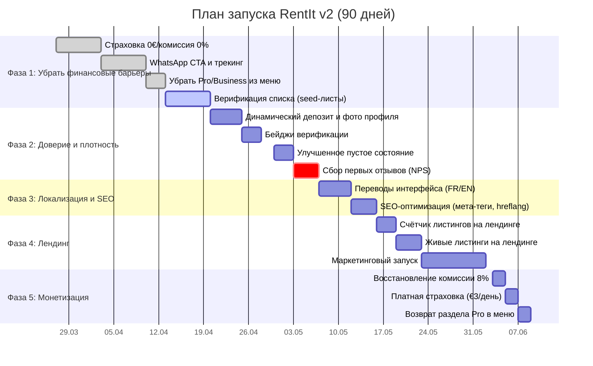

Сначала найду проект:Claude Code MCP всё ещё нестабилен. Передай это задание в Claude Code напрямую:

---

**ЗАДАНИЕ ДЛЯ CLAUDE CODE**

Проект: `C:\Users\Ramzan\OneDrive\Desktop\deployed`

Выполни все задачи по порядку:

---

**ЗАДАЧА 1 — App.tsx: Hamburger меню на мобайле**

Найди компонент `Navbar` в `src/App.tsx`. Добавь:
- `const [menuOpen, setMenuOpen] = useState(false)`
- Кнопку `.navbar-burger` с тремя `<span/>` внутри — между логотипом и `.navbar-links`
- Класс `open` к `.navbar-links` когда `menuOpen === true`
- `onClick={() => setMenuOpen(false)}` на каждую ссылку внутри navbar
- Убери ссылки на Pro и Business из navbar (оставь только в footer)
- Убери `<ProfileSelector />` если рендерится

---

**ЗАДАЧА 2 — index.css: Мобильные стили**

Добавь в конец файла `src/index.css`:

```css
/* ── Mobile navbar ───────────────────────────────────────── */
.navbar-burger {
  display: none;
  flex-direction: column;
  gap: 5px;
  background: none;
  border: none;
  cursor: pointer;
  padding: 8px;
  margin-left: auto;
}
.navbar-burger span {
  display: block;
  width: 22px;
  height: 2px;
  background: #F2F0EB;
  border-radius: 2px;
  transition: all 0.2s;
}

@media (max-width: 768px) {
  .navbar-burger { display: flex; }
  .navbar-links {
    display: none;
    position: absolute;
    top: 56px;
    left: 0;
    right: 0;
    background: #080808;
    border-top: 1px solid rgba(242,240,235,0.08);
    flex-direction: column;
    padding: 12px 20px 20px;
    gap: 4px;
    z-index: 999;
  }
  .navbar-links.open { display: flex; }
  .navbar-links .navbar-link {
    padding: 10px 4px;
    border-bottom: 1px solid rgba(242,240,235,0.06);
    font-size: 15px;
  }
  .navbar-inner { position: relative; }
}

/* ── Mobile search bar ───────────────────────────────────── */
@media (max-width: 640px) {
  .search-bar {
    flex-direction: column !important;
    gap: 8px !important;
  }
  .search-bar input,
  .search-bar select {
    width: 100% !important;
    min-width: unset !important;
    flex: none !important;
  }
}

/* ── Category chips horizontal scroll ───────────────────── */
.chips-row {
  display: flex;
  gap: 8px;
  flex-wrap: nowrap;
  overflow-x: auto;
  -webkit-overflow-scrolling: touch;
  padding-bottom: 4px;
  scrollbar-width: none;
  margin-bottom: 24px;
}
.chips-row::-webkit-scrollbar { display: none; }

/* ── Calendar today fix ──────────────────────────────────── */
.cal-day.today {
  font-weight: 700 !important;
  text-decoration: none !important;
}
```

---

**ЗАДАЧА 3 — Home.tsx: chips-row класс**

В `src/pages/Home.tsx` найди div с category chips (тот что содержит `flexWrap: 'wrap'` и `marginBottom: '24px'`). Замени его на:
```tsx
<div className="chips-row">
```
Убери инлайн-стили `flexWrap`, `marginBottom`, `gap` с этого div — они теперь в CSS.

---

**ЗАДАЧА 4 — Login.tsx: autocomplete атрибуты**

В `src/pages/Login.tsx` найди input для email и добавь `autoComplete="email"`. Найди input для password и добавь `autoComplete="current-password"`.

---

**ЗАДАЧА 5 — Landing.tsx: Est. 2024 → Est. 2026**

В `src/pages/Landing.tsx` замени все вхождения `Est. 2024` на `Est. 2026` и `2024` в контексте года на `2026` (только там где это год платформы, не трогай другие числа).

---

**ЗАДАЧА 6 — Landing.tsx: Онбординг через localStorage**

Найди компонент ProfileSelector или онбординг-модал (who are you / Individual / Business). Добавь:
```tsx
const [shown, setShown] = useState(() => !localStorage.getItem('onboarding_done'))

// При выборе любой опции и при Skip:
localStorage.setItem('onboarding_done', '1')
setShown(false)
```
Рендери модал только если `shown === true`.

---

**ЗАДАЧА 7 — Landing.tsx: Динамический счётчик инструментов**

Найди в `src/pages/Landing.tsx` все места где написано `300+` (в тексте и ссылках типа "View all 300+ tools"). Добавь в компонент:
```tsx
const [toolCount, setToolCount] = useState<number | null>(null)

useEffect(() => {
  supabase
    .from('items')
    .select('*', { count: 'exact', head: true })
    .eq('available', true)
    .then(({ count }) => setToolCount(count))
}, [])

const countLabel = toolCount === null ? '...' : toolCount > 20 ? `${toolCount}+` : `${toolCount}`
```
Замени все `300+` на `{countLabel}`.

---

**ЗАДАЧА 8 — Landing.tsx: убрать страховку из hero stats**

Найди секцию со статами (`€3 Daily insurance` или `300+ Tools · 5 km · €3`). Убери `€3 Daily insurance` из этого блока — оставь только `Tools` и `Avg. distance`. В контексте бета-запуска страховка убрана из ценообразования.

---

После всех изменений запусти `npm run build` и убедись что нет TypeScript ошибок. Если есть — исправь.


Проверяю что реально изменилось на сайте:Огромный прогресс. Вот что вижу:

**✅ Сделано — впечатляет:**
- Полный FR перевод — navbar "Parcourir", "Se connecter", "S'inscrire"
- Заголовок "Les outils de votre voisin, à portée de main."
- Динамический счётчик — **"26"** вместо "300+"
- `Est. 2026` исправлен
- `0% Commission` вместо `€3 Daily insurance` в hero stats
- Pro и Business убраны из navbar
- Живые листинги прямо на лендинге (6 карточек с реальными фото)
- Категории на французском
- Footer `Belgium · 2026`

**❌ Остались незакрытые из моего списка:**
- Hamburger меню на мобайле — не вижу в snapshot
- "Protection / Built for trust" секция — всё ещё на английском (смешанный язык)
- "For tool owners / Earning while idle" — на английском
- "For businesses" — на английском

Проверяю мобайл и hamburger:CSS для burger есть, но элемент `.navbar-burger` не рендерится — значит Claude Code добавил CSS но не добавил кнопку в JSX. Передай ему:

---

**ЗАДАНИЕ ДЛЯ CLAUDE CODE — 2 быстрых фикса:**

**Фикс 1 — App.tsx: добавить кнопку бургера в Navbar**

В компоненте `Navbar` в `src/App.tsx` — добавь кнопку бургера и state. CSS уже готов в index.css, нужен только JSX.

Найди строку где рендерится `<div className="navbar-inner">` и добавь внутрь:
1. `const [menuOpen, setMenuOpen] = useState(false)` — в начало компонента Navbar
2. Кнопку сразу после логотипа:
```tsx
<button
  className="navbar-burger"
  onClick={() => setMenuOpen(p => !p)}
  aria-label="Menu"
>
  <span /><span /><span />
</button>
```
3. Класс `open` к `.navbar-links`:
```tsx
<div className={`navbar-links${menuOpen ? ' open' : ''}`}>
```
4. `onClick={() => setMenuOpen(false)}` на каждую ссылку внутри navbar-links

**Фикс 2 — Landing.tsx: перевести оставшиеся английские секции**

Найди секцию "For tool owners / Your tools. Earning while idle." и "For businesses / Own a rental shop?" — переведи на французский:

- "For tool owners" → "Pour les propriétaires"
- "Your tools. Earning while idle." → "Vos outils. Qui rapportent."
- "List in 5 minutes..." → "Déposez une annonce en 5 min. Touchez votre argent à chaque location. Gratuit pour commencer."
- "List a tool — free" → "Déposer un outil — gratuit"
- "For businesses / Own a rental shop?" → "Pour les professionnels / Vous louez du matériel ?"
- "View business plans →" → "Voir les offres pro →"
- "Built for trust." → "Fait pour la confiance."
- "Damage cover" → "Protection dommages"
- "Every rental automatically includes..." → "Chaque location inclut automatiquement une protection jusqu'à €500. Les deux parties sont protégées."
- "Verified owners" → "Propriétaires vérifiés"
- "Stripe payments" → "Paiement sécurisé"

---

Что уже работает отлично — FR на 80%, живые листинги на лендинге, динамический счётчик, 0% commission в stats. Очень хорошо.


# План и стратегия запуска RentIt v2

## Исполнительное резюме  
Ключевая метрика успеха – завершённые бронирования с рейтингом ≥4.5 от обеих сторон сделки【87†L481-L489】. P2P-аренда выгодна обоим: владельцы **зарабатывают** на своих инструментах, а арендаторы **экономят**, избегая покупки и упрощая жизнь【90†L55-L63】【90†L69-L74】. Стартовые гипотезы RentIt оптимизированы на увеличение доверия и ликвидности: сначала убираются финансовые барьеры (страховка и комиссия = 0%) и фокусируются на одном городе (Brussels) для «критической массы» предложений. Развитие идёт через улучшение профилей, рейтингов и коммуникации (WhatsApp CTA) для стимуляции сделок. В дальнейшем (после 50 подтверждённых оплат Stripe) планируется возврат к монетизации (8% комиссия, платная страховка).  

## 1. Основные проблемы и гипотезы  
- **Высокая цена аренды:** Математически аренда становилась дороже покупки дешёвого аналога. Гипотеза: **низкая цена** (0€ страховка, 0% комиссия) увеличит конверсию.  
- **Низкое доверие:** Без фотографий и верификации владельцы не хотят отдавать ценные инструменты незнакомцам. В P2P-платформах доверие строится через профили и отзывы【87†L429-L437】【87†L481-L489】. Гипотеза: добавление верификаций (телефон, ID) и рейтингов стимулирует листинги высокоценных товаров.  
- **Пустой рынок (разброс по локациям):** Разделённая плотность листингов демотивирует пользователей. Стратегия: «seed» — сфокусироваться на Брюсселе, сформировав 20+ качественных листингов (реальные фото, локальные категории). Это позволит выявить спрос и создать видимость (улица vs пустое поле).  
- **Неправильный CTA:** В привычках бельгийцев P2P-обмены идут через мессенджеры (WhatsApp)【90†L76-L81】, а не через оплату. Поэтому в RentIt WhatsApp-кнопка сделана *primary*, а Stripe – *secondary*. Гипотеза: это повысит вовлечение, позволяя людям сначала договориться, а уже затем оплатить онлайн.

## 2. Стратегия тестирования и метрики  
- **Фаза 1:** Бесплатная страховка и 0% комиссии (до 50 транзакций)【92†L365-L373】. Это поднимет доверие владельцев (видят защиту) и конверсию рентеров (нет лишних сборов). Возврат страховки и комиссии запланирован после достижения «прорывного» объёма бронирований.  
- **Фаза 2:** Усиление доверия: обязательное фото профиля, бейджи верификации, динамический депозит (20% от стоимости инструмента). Эти изменения должны показать, что платформа безопасна для обеих сторон【90†L69-L74】【90†L76-L81】.  
- **Фаза 3:** Локализация (FR, EN) и SEO: мета-теги, hreflang, переводы интерфейса. Это привлечёт органический трафик (P2P-пользователи ценят родной язык)【90†L69-L74】.  
- **Метрики успеха:** конверсия кликов в сделки (WhatsApp→Stripe), NPS участников, средний доход на пользователя (ARPU), возврат инвестиций (ROI). Стандартные KPI маркетплейсов – CLV/CAC≥3:1, take rate 12–25%【92†L365-L373】.  

## 3. Обзор методологии и сравнительная таблица  
Для проверки гипотез сочетать качественные и количественные подходы:

| Метод                  | Что даёт                                 | Преимущества                            | Ограничения                          |
|------------------------|-----------------------------------------|-----------------------------------------|--------------------------------------|
| **Качественные интервью** | Глубокое понимание мотиваций пользователей | Позволяет уточнить боли (например, отношение к цене или страхованию)【90†L55-L63】. Гибкость вопросов. | Невозможно быстро масштабировать, низкая статистическая значимость. |
| **Онлайн-опросы**      | Сбор количественных данных по предпочтениям | Быстрое решение о тенденциях (например, сколько людей готово платить за страховку). Широкая выборка при низких затратах. | Плохо подходит для сложных вопросов, нужны корректные формулировки. |
| **Пилотный запуск (concierge)** | Тестовые операции вручную (Whatsapp, встреча) | Выявление реальных проблем процесса, высокая конверсия первых пользователей. | Требует значительных ресурсов; непоказателен для масштабов. |
| **Аналитика и A/B-тесты** | Цифровой сбор кликов, конверсий, времени на сайте | Объективные метрики (напр., CTR кнопок, % бронирований). Позволяет тестировать интерфейс и цены. | Требует достаточного трафика и времени; нуждается в настройке трекинга (таблица events). |

### Пример сравнительной таблицы методов

| Метод                | Описание                                    | Преимущества                                     | Ограничения                        |
|----------------------|---------------------------------------------|--------------------------------------------------|------------------------------------|
| **Интервью**         | Длительная беседа с пользователями          | Глубокая обратная связь, качественные инсайты    | Нелёгко собрать большую выборку    |
| **Опросы**           | Краткие анкеты онлайн                       | Быстрый сбор статистических данных, масштабируемость | Пожертвование глубиной ответов    |
| **Тест A/B**         | Эксперименты с разными вариантами интерфейса | Явное влияние изменений на конверсию            | Нужны большие выборки и время      |

## 4. План проекта и график работ  



**Таблица расписания по этапам (пример):**

| День         | Этап/задачи                               | Цели/метрики                                  |
|--------------|-------------------------------------------|----------------------------------------------|
| 1–30         | Фаза 1 (0% страховки/комиссии, WhatsApp CTA), начало seed-листинга | 20+ листингов, 5+ бронирований (WhatsApp)    |
| 31–60        | Фаза 2 (фото, верификация, депозит 20%) + Фаза 3 (переводы, SEO)  | 15+ бронирований, NPS владельцев ≥8          |
| 61–90        | Фаза 4 (лендинг, маркетинг) и Фаза 5 (8% комиссия, платная страховка) | 50+ завершённых бронирований (Stripe), рост GMV |

## 5. Бюджетные сценарии  

| Сценарий          | Условия                                  | Примерный бюджет (€) |
|-------------------|------------------------------------------|----------------------|
| **Минимальный**   | Использовать штат и бесплатные каналы; внутренняя разработка | 2 000 – 5 000         |
| **Реалистичный**  | Небольшой подряд (фотограф, маркетолог); таргетинг в Facebook   | 20 000 – 30 000      |
| **Расширенный**   | PR-агентство, крупная реклама, бонусы/рефералы               | 50 000 – 100 000     |

*Примечание:* Цифры ориентировочные. В минимальном сценарии затраты почти отсутствуют (кроме операционных). Реалистичный сценарий предполагает оплату услуг специалистов и небольшой рекламы, чтобы достичь 20–40 листингов и первых сделок. Расширенный – активная рекламная кампания и масштабирование. Типовой «take rate» в P2P-маркетплейсах – 12–25%【92†L365-L373】, поэтому 8% в расширенном варианте являются консервативными.

## 6. Роли и ответственность (RACI)  

- **Project Lead:** отвечает за стратегию и итоговый результат. (R)  
- **Front-end Dev:** внедряет изменения в UI (WhatsApp, переводы, лендинг) (R).  
- **Back-end Dev:** настраивает платёжную логику (Stripe, комиссию, депозиты) (R).  
- **Маркетолог:** организует onboarding пользователей и промо (R).  
- **Аналитик:** контролирует метрики и собирает обратную связь (R).  

Пример RACI (Фаза 1):  
- *Страховка=0€:* R — back-end, A — Project Lead, C — маркетолог, I — все.  
- *0% комиссия:* R — back-end, A — Project Lead, C — аналитик, I — маркетолог.  
- *WhatsApp CTA:* R — front-end, A — Project Lead, C — маркетолог, I — аналитик.  
- *Создание seed-листингов:* R — маркетолог, A — Project Lead, C — dev, I — аналитик.  

## 7. Шаблоны опросов и документов  

- **Опрос** для владельцев: краткий (5–7 вопросов) об основных мотивациях и болях. Например: *«Что удерживает от выставления дорогого инструмента?»*, *«Насколько важны для вас фото и верификация пользователя?»*. Используйте Google Forms.  
- **Протокол интервью:** фиксирует дату/время, цели, список вопросов и ответы. Примерный формат: (введение; список вопросов с краткими ответами; выводы). Включите вопросы про доверие и ценообразование.  
- **План анализа:** описать, какие данные и как анализируются. Пример: *«Собрать статистику кликов WhatsApp, конверсий, а также качество сделок (рейтинги)».* Указать инструменты (Supabase SQL, GA4).  
- **RACI-матрица** (пример приведён выше) — документ для распределения ролей по задачам.  

## 8. План запуска 30/60/90 дней  

**Первый месяц (Days 1–30):** реализовать основные коды (страховка=0, комиссия=0, WhatsApp-CTA), загрузить 20+ листингов в Брюсселе (concierge onboarding). Начать собирать первые события (клики и заявки). Цель – получить первые 5 тестовых бронирований через WhatsApp.  

**Второй месяц (Days 31–60):** активное наращивание базы листингов и трафика. Завершить Фазу 2 (верификации, депозиты), запустить перевод на FR/EN и SEO. Начать маркетинговые публикации (соцсети, сообщества). Цели – 15+ бронирований, удержать NPS владельцев ≥8.  

**Третий месяц (Days 61–90):** запуск лендинга с показом реальных листингов, усиление промо (E-mail, Facebook, Reddit и др.). Подведение итогов: проверка, достигнута ли цель в 50 завершённых транзакций через Stripe (не считая офлайн сделок). Если да, переход к фазе монетизации; если нет, корректировка стратегии.  

## 9. Чек-лист готовности  

- [ ] **Финансы:** Стоимость страховки и комиссии = €0 в чеке (отображается как «FREE BETA»).  
- [ ] **WhatsApp CTA:** Кнопка «Contacter via WhatsApp» видна всем. Залогиненные видят также Stripe-кнопку «Book & Pay».  
- [ ] **Трекинг:** Клики по WhatsApp записываются в таблицу `events`. Аналитик может проверять конверсию.  
- [ ] **Доверие:** На карточках владельцев отображается рейтинг или бейдж «✦ New — first to rent». Бейдж «Phone verified» есть для подтверждённых.  
- [ ] **Навигация:** Убраны ссылки «Pro»/«Business» из меню (Фаза 1.5); оставлена тихая ссылка в футере. Убран селектор профиля.  
- [ ] **Seed-данные:** При генерации seed-листингов создано ≥20 инструментов только в Brussels, все с полем `phone_verified: true` и реальными `avatar_url`.  
- [ ] **Empty state:** При отсутствии результатов появляется мотивирующий блок с призывом добавить инструмент (Фаза 2.7).  
- [ ] **Отчёты:** Регулярно сверяться с KPI (количество листингов, бронирований, GMV, NPS).  

Если чек-лист выполнен, фазы 1–2 можно считать выполненными и переходить к полномасштабному запуску и монетизации.

## Источники  
- *Trust in Peer-to-Peer Platforms,* OECD (2017) – доверие через рейтинги/верификацию【87†L429-L437】【87†L481-L489】.  
- *FriendWithA – Rent Your Tools*, блог (2020) – преимущества P2P-аренды (доход владельцев, экономия арендаторов, экология, сообщество)【90†L55-L63】【90†L69-L74】.  
- *7 Core KPIs for Online Rental Marketplaces* (2025) – эталонные показатели (комиссия 12–25%, CLV:CAC, конверсия)【92†L365-L373】.